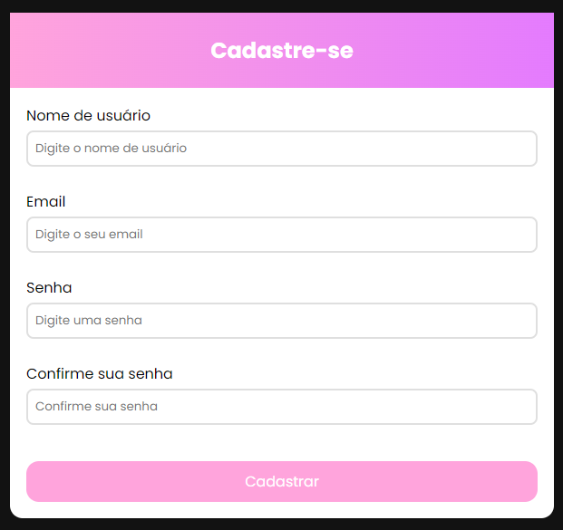

# Formulário de Cadastro com Validação

Este é um projeto de formulário de cadastro com validação implementada, desenvolvido utilizando HTML, CSS e JavaScript. O formulário incorpora funcionalidades de validação para garantir a precisão e integridade dos dados inseridos pelos usuários.

## Funcionalidades

- Validação de e-mail
- Validação de nome de usuário
- Validação de senha (comprimento mínimo de 8 caracteres)

## Como Utilizar

1. Clone este repositório para o seu ambiente local.
2. Abra o arquivo `index.html` em seu navegador web.
3. Preencha o formulário de cadastro.
4. Observe a validação dos campos em tempo real.
5. Submeta o formulário quando todos os campos estiverem preenchidos corretamente.

## Contribuição

Contribuições são bem-vindas! Sinta-se à vontade para abrir uma issue ou enviar um pull request com melhorias, correções de bugs, ou novas funcionalidades.

## Autora

Jéssica Sampaio

